# Project Name: chatApp

## Description:
Разработка мобильного мессенджера: клиент запускает
приложение, вводит номер телефона, ему приходит СМС, если все выполнено успешно, то он переходит на главный экран. 

Данные хранятся при помощи **Google FireBase**.

## Work example:
**Регистрация:**

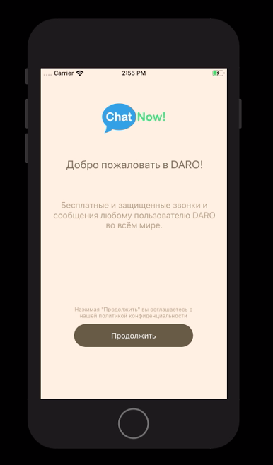 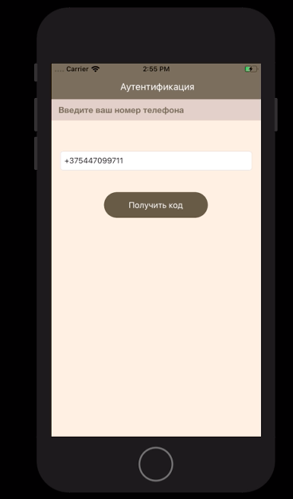

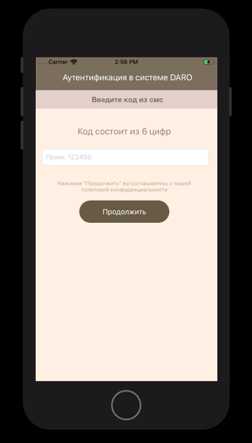 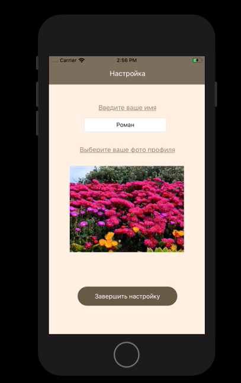
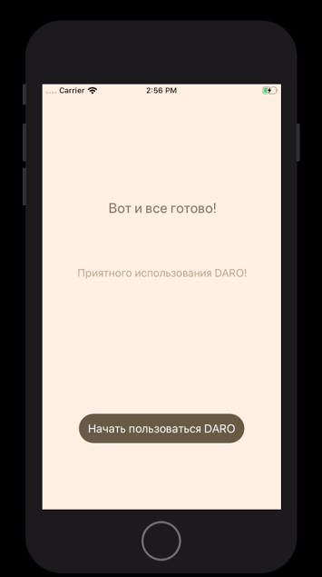

**Текстовый чат:**

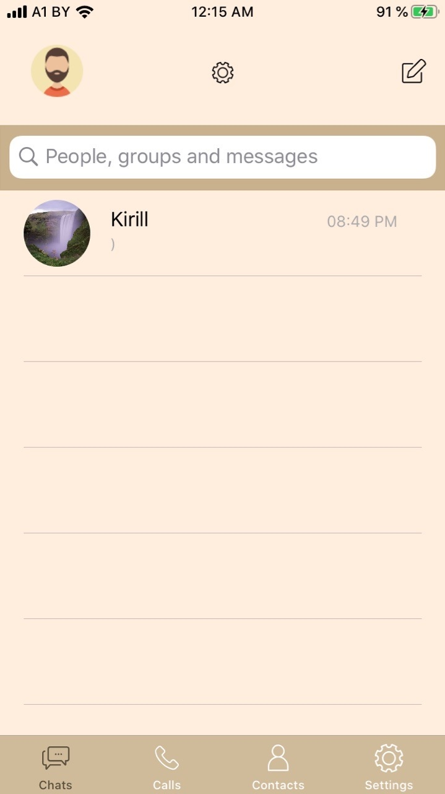 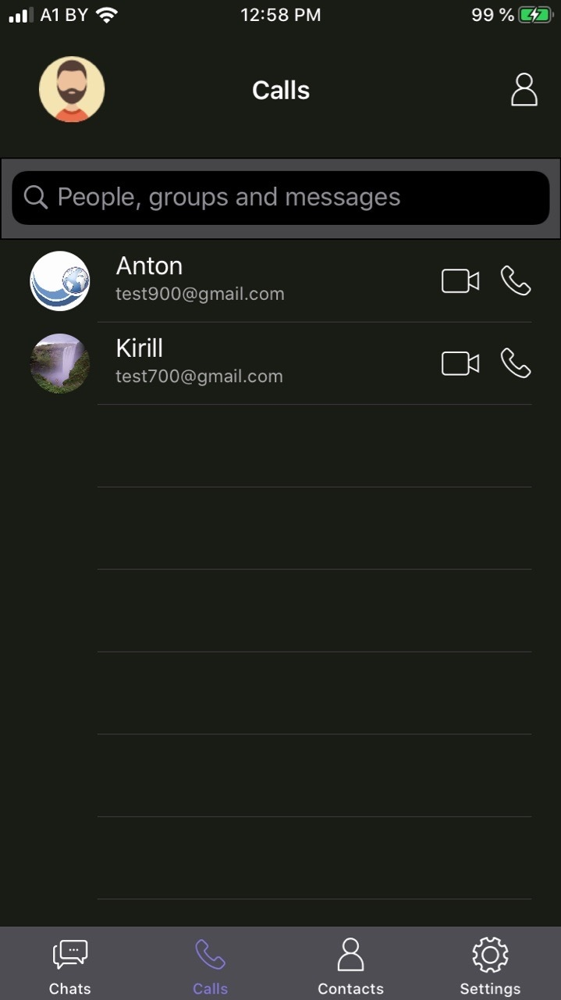

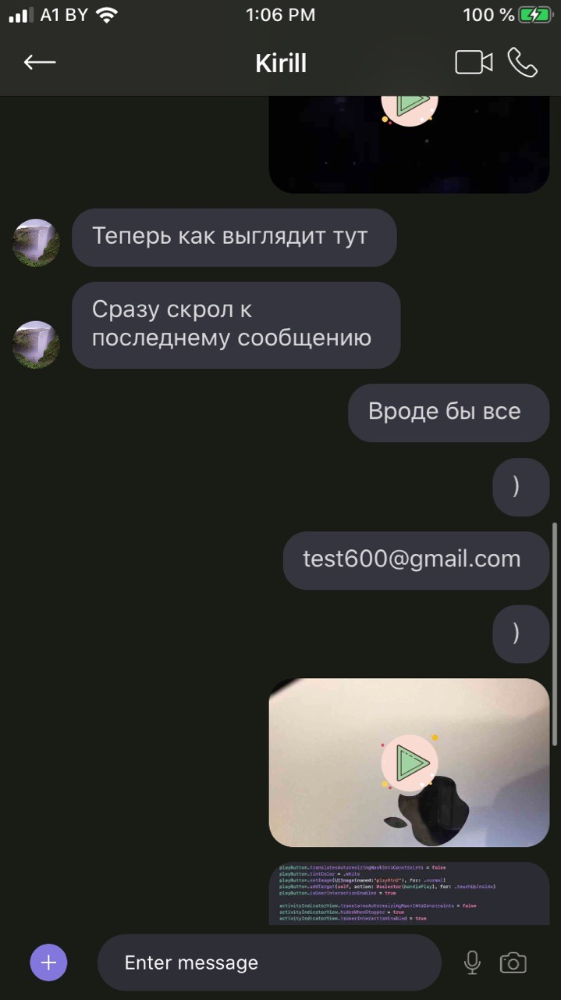 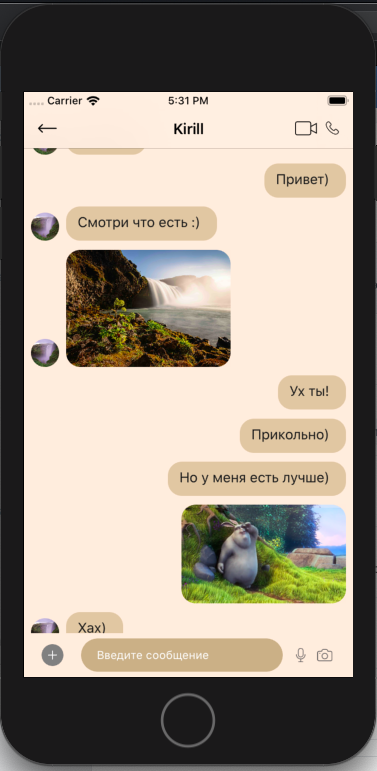

**Прочее:**

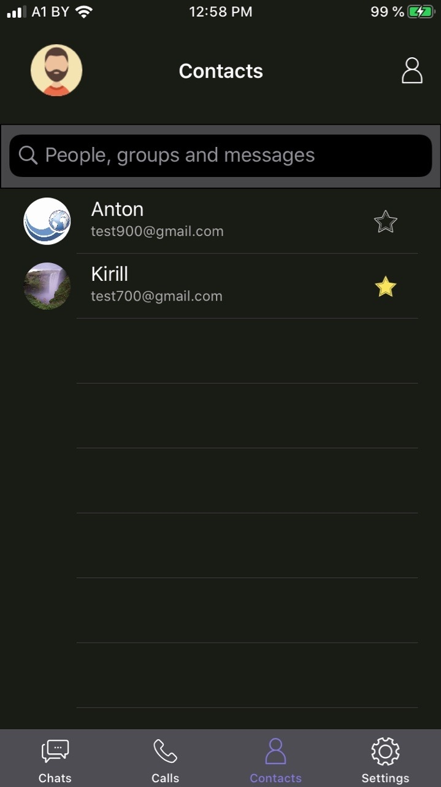 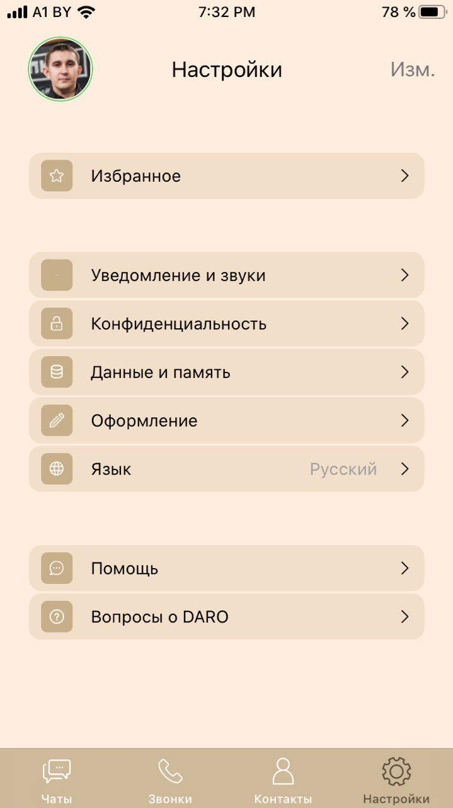

### Installation:
1. Зайти в AppStore и найти chatApp ( в процессе )
2. Нажать "Установить"

## Usage:
**Авторизируйтесь/Войди** в мессенджер и пишите вашим друзьям когда вздумаеться!

